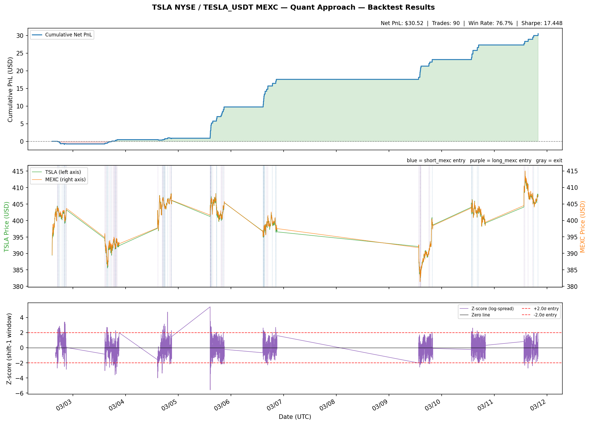

# Backtest Report — TSLA NYSE / TESLA_USDT MEXC (Quant Approach)

Generated: 2026-03-12 03:38 UTC

---

## Strategy Summary

This backtest implements **the Quant Approach** — a spread mean-reversion
pair trade between two instruments that represent the same underlying asset (Tesla):

| Leg | Instrument | Venue | Type |
|---|---|---|---|
| Leg 1 | **TSLA** | NASDAQ / NYSE | Equity |
| Leg 2 | **TESLA_USDT** | MEXC Exchange | Perpetual Futures |

### How It Works

Both instruments expose the holder to Tesla price movements.  During NYSE trading hours
(09:30–16:00 ET), they should price identically — but temporary divergences arise due to:
- Different liquidity pools and participant types
- Latency between the two venues
- MEXC funding rate pressure between settlement windows

We measure divergence using the **log-ratio spread** and its **rolling z-score**:

```
log_spread = log(mexc_close / tsla_close)

# Strictly lookahead-free z-score (Quant approach):
shifted     = log_spread.shift(1)           # at bar t, use bars [t-W, t-1]
rolling_mean = shifted.rolling(90).mean()
rolling_std  = shifted.rolling(90).std()
z_score      = (log_spread - rolling_mean) / rolling_std
```

When `|z| ≥ 2.0σ` we open a pair trade:
- **z ≥ +2.0**: MEXC overpriced → **SHORT MEXC, LONG TSLA**
- **z ≤ -2.0**: MEXC underpriced → **LONG MEXC, SHORT TSLA**

We fill the position at the **next bar's OPEN** (order sent at close, filled at next open).

We exit when:
1. End of NYSE session (force close, no overnight TSLA equity exposure)
2. Position held ≥ 20 minutes (time-based protection, replaces stop-loss)
3. z-score crosses zero (spread fully reverted to rolling mean)
4. End of data (cleanup)


Statistical evidence:
- **Correlation**: 0.92 between TSLA and TESLA_USDT returns (during NYSE hours)
- **ADF p-value**: < 0.001 (spread is stationary — it will revert)


---

## Backtest Parameters

| Parameter | Value |
|:---|:---|
| Backtest Period | 2026-03-02 → 2026-03-12 |
| MEXC Symbol | TESLA_USDT |
| yfinance Ticker | TSLA |
| Bar Interval | 1-minute OHLCV |
| Spread Formula | log(mexc_close / tsla_close) |
| Z-score Method | shift(1) before rolling — strictly lookahead-free |
| Z-score Window | 90 bars (minutes) |
| Entry Threshold | ±2.0σ |
| Exit Threshold | z crosses 0 (full mean reversion) |
| Max Holding Time | 20 bars (minutes) |
| Stop-Loss | None (max_holding replaces stop-loss) |
| Entry Execution | Next bar's OPEN price (realistic fill) |
| Exit Execution | Current bar's CLOSE price |
| Position Size | 1 TSLA share equivalent per leg |
| MEXC Fee | 2 bps maker + 1 bps slippage = 3 bps/side |
| NYSE Fee | $0.01/share/side |
| Round-trip (MEXC) | 6 bps total |
| Round-trip (NYSE) | $0.02/share total |

---

## Performance Metrics

| Metric | Value |
|:---|---:|
| Total Net PnL | $     30.52 |
| Total Gross PnL | $     53.88 |
| Total Fees (MEXC + NYSE) | $     23.37 |
|   ↳ MEXC fees | $     21.57 |
|   ↳ NYSE fees | $      1.80 |
| Number of Trades |          90 |
| Win Rate |       76.7% |
| Avg PnL per Trade | $      0.34 |
| Best Trade | $      1.01 |
| Worst Trade | $     -0.38 |
| Sharpe Ratio |      17.448 |
| Max Drawdown (USD) | $     -0.87 |
| Max Drawdown (%) |       0.00% |
| Avg Holding Time |     4.3 min |
| Profit Factor |      21.646 |
| **Exit Reasons** | |
| &nbsp;&nbsp;max_holding | 3 |
| &nbsp;&nbsp;session_end | 2 |
| &nbsp;&nbsp;signal | 85 |

---

## Equity Curve



*Top panel: cumulative net PnL.  Middle panel: TSLA (green) and MEXC (orange) prices
with trade markers (blue = short_mexc entry, purple = long_mexc entry, gray = exit).
Bottom panel: log-spread z-score with ±2.0σ entry bands.*

---

---

## Trade Log

*Full log saved to: `trades_20260312_033854.csv`*

| # | Entry | Exit | Direction | Entry Z | Exit Z | Hold | Exit Reason | Gross | Fees | Net |
|---|---|---|---|---:|---:|---:|---|---:|---:|---:|
| 1 | 03-02 16:51 | 03-02 16:55 | long_mexc | -2.71 | +0.26 | 4m | signal | $+0.225 | $0.262 | $-0.037 |
| 2 | 03-02 17:02 | 03-02 17:03 | short_mexc | +2.41 | -0.08 | 1m | signal | $+0.230 | $0.262 | $-0.032 |
| 3 | 03-02 17:12 | 03-02 17:13 | long_mexc | -2.08 | +0.37 | 1m | signal | $+0.215 | $0.262 | $-0.047 |
| 4 | 03-02 17:25 | 03-02 17:45 | short_mexc | +2.60 | +1.46 | 20m | max_holding | $+0.075 | $0.262 | $-0.187 |
| 5 | 03-02 17:50 | 03-02 18:10 | short_mexc | +2.85 | +2.26 | 20m | max_holding | $-0.117 | $0.261 | $-0.378 |
| 6 | 03-02 19:02 | 03-02 19:03 | short_mexc | +2.08 | -0.26 | 1m | signal | $+0.290 | $0.261 | $+0.029 |
| 7 | 03-02 19:42 | 03-02 19:55 | short_mexc | +2.01 | -0.21 | 13m | signal | $+0.170 | $0.262 | $-0.092 |
| 8 | 03-02 20:01 | 03-02 20:02 | short_mexc | +2.07 | -0.23 | 1m | signal | $+0.133 | $0.262 | $-0.128 |
| 9 | 03-02 20:07 | 03-02 20:08 | long_mexc | -2.50 | +3.40 | 1m | signal | $+0.450 | $0.261 | $+0.189 |
| 10 | 03-02 20:16 | 03-02 20:31 | short_mexc | +3.38 | -0.73 | 15m | signal | $+0.235 | $0.260 | $-0.025 |
| 11 | 03-02 20:42 | 03-02 20:49 | short_mexc | +2.03 | -0.40 | 7m | signal | $+0.245 | $0.261 | $-0.016 |
| 12 | 03-02 20:55 | 03-02 20:59 | long_mexc | -2.36 | +0.02 | 5m | session_end | $+0.240 | $0.262 | $-0.022 |
| 13 | 03-03 14:34 | 03-03 14:35 | long_mexc | -3.06 | +1.09 | 1m | signal | $+0.424 | $0.257 | $+0.167 |
| 14 | 03-03 14:38 | 03-03 14:39 | long_mexc | -2.16 | +0.91 | 1m | signal | $+0.305 | $0.256 | $+0.049 |
| 15 | 03-03 15:09 | 03-03 15:10 | long_mexc | -2.43 | +0.13 | 1m | signal | $+0.230 | $0.255 | $-0.025 |
| 16 | 03-03 15:21 | 03-03 15:33 | short_mexc | +2.35 | -0.34 | 12m | signal | $+0.320 | $0.253 | $+0.067 |
| 17 | 03-03 15:40 | 03-03 15:48 | short_mexc | +2.46 | -0.35 | 8m | signal | $+0.390 | $0.252 | $+0.138 |
| 18 | 03-03 16:02 | 03-03 16:05 | short_mexc | +2.05 | -0.68 | 3m | signal | $+0.408 | $0.253 | $+0.155 |
| 19 | 03-03 16:41 | 03-03 16:44 | long_mexc | -2.62 | +0.14 | 3m | signal | $+0.320 | $0.255 | $+0.065 |
| 20 | 03-03 17:11 | 03-03 17:20 | short_mexc | +2.08 | -0.01 | 9m | signal | $+0.300 | $0.255 | $+0.045 |
| 21 | 03-03 17:41 | 03-03 17:42 | long_mexc | -2.31 | +1.13 | 1m | signal | $+0.415 | $0.255 | $+0.160 |
| 22 | 03-03 18:24 | 03-03 18:26 | long_mexc | -2.39 | +0.27 | 2m | signal | $+0.230 | $0.256 | $-0.026 |
| 23 | 03-03 18:40 | 03-03 18:41 | long_mexc | -2.27 | +0.37 | 1m | signal | $+0.215 | $0.257 | $-0.042 |
| 24 | 03-03 18:51 | 03-03 18:54 | long_mexc | -2.14 | +0.60 | 3m | signal | $+0.332 | $0.256 | $+0.076 |
| 25 | 03-03 19:07 | 03-03 19:09 | long_mexc | -2.05 | +0.87 | 2m | signal | $+0.252 | $0.256 | $-0.003 |
| 26 | 03-03 19:12 | 03-03 19:19 | long_mexc | -3.61 | +0.88 | 7m | signal | $+0.385 | $0.255 | $+0.130 |
| 27 | 03-03 19:27 | 03-03 19:31 | short_mexc | +2.10 | -1.83 | 4m | signal | $+0.370 | $0.255 | $+0.115 |
| 28 | 03-03 19:38 | 03-03 19:39 | long_mexc | -3.14 | +0.07 | 1m | signal | $+0.232 | $0.256 | $-0.024 |
| 29 | 03-03 19:40 | 03-03 19:55 | long_mexc | -3.47 | +0.02 | 15m | signal | $+0.320 | $0.256 | $+0.064 |
| 30 | 03-03 20:07 | 03-03 20:13 | long_mexc | -2.53 | +0.31 | 6m | signal | $+0.364 | $0.256 | $+0.108 |
| 31 | 03-04 14:34 | 03-04 14:54 | long_mexc | -2.51 | -0.36 | 20m | max_holding | $+0.142 | $0.260 | $-0.119 |
| 32 | 03-04 16:39 | 03-04 16:40 | long_mexc | -3.39 | +0.78 | 1m | signal | $+0.345 | $0.263 | $+0.082 |
| 33 | 03-04 16:42 | 03-04 16:45 | long_mexc | -2.94 | +0.24 | 3m | signal | $+0.270 | $0.263 | $+0.007 |
| 34 | 03-04 16:55 | 03-04 17:02 | short_mexc | +2.37 | -0.01 | 7m | signal | $+0.244 | $0.264 | $-0.020 |
| 35 | 03-04 17:14 | 03-04 17:15 | short_mexc | +2.88 | -0.90 | 1m | signal | $+0.311 | $0.264 | $+0.047 |
| 36 | 03-04 17:25 | 03-04 17:27 | long_mexc | -2.10 | +0.65 | 2m | signal | $+0.278 | $0.263 | $+0.015 |
| 37 | 03-04 17:38 | 03-04 17:41 | short_mexc | +3.13 | -1.81 | 3m | signal | $+0.465 | $0.263 | $+0.202 |
| 38 | 03-04 17:46 | 03-04 17:48 | short_mexc | +2.15 | -0.16 | 2m | signal | $+0.204 | $0.263 | $-0.059 |
| 39 | 03-04 17:58 | 03-04 18:04 | short_mexc | +2.49 | -0.95 | 6m | signal | $+0.375 | $0.262 | $+0.113 |
| 40 | 03-04 19:07 | 03-04 19:12 | short_mexc | +4.72 | -0.23 | 5m | signal | $+0.500 | $0.264 | $+0.236 |
| 41 | 03-04 20:05 | 03-04 20:07 | long_mexc | -2.17 | +0.32 | 2m | signal | $+0.180 | $0.264 | $-0.084 |
| 42 | 03-04 20:35 | 03-04 20:39 | long_mexc | -2.12 | +0.11 | 4m | signal | $+0.230 | $0.264 | $-0.034 |
| 43 | 03-04 20:40 | 03-04 20:42 | long_mexc | -2.09 | +0.18 | 2m | signal | $+0.186 | $0.264 | $-0.078 |
| 44 | 03-04 20:52 | 03-04 20:58 | short_mexc | +2.28 | -1.48 | 6m | signal | $+0.360 | $0.264 | $+0.096 |
| 45 | 03-05 14:31 | 03-05 14:33 | short_mexc | +5.41 | -4.99 | 2m | signal | $+0.879 | $0.261 | $+0.618 |
| 46 | 03-05 14:34 | 03-05 14:36 | long_mexc | -5.59 | +1.02 | 2m | signal | $+0.849 | $0.262 | $+0.587 |
| 47 | 03-05 14:37 | 03-05 14:39 | long_mexc | -3.46 | +3.49 | 2m | signal | $+1.130 | $0.262 | $+0.868 |
| 48 | 03-05 14:43 | 03-05 14:44 | short_mexc | +2.25 | -0.36 | 1m | signal | $+0.400 | $0.262 | $+0.138 |
| 49 | 03-05 14:47 | 03-05 14:50 | long_mexc | -2.66 | +2.59 | 3m | signal | $+1.020 | $0.263 | $+0.757 |
| 50 | 03-05 14:53 | 03-05 14:54 | short_mexc | +2.80 | -2.46 | 1m | signal | $+1.045 | $0.264 | $+0.782 |

*... 40 more trades — see trades CSV for full log ...*

---

*Report generated by the TSLA/MEXC Spread Arbitrage System — Quant Approach (Strategy A).*
